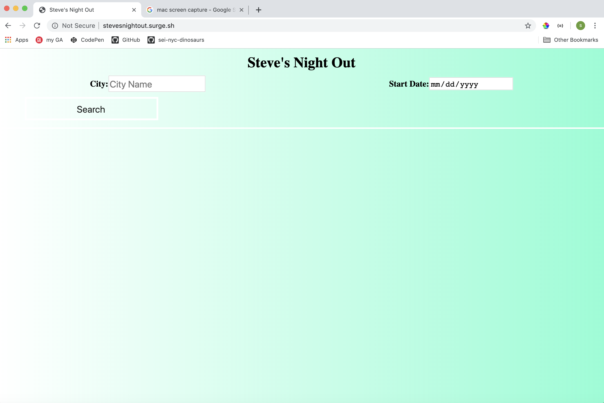
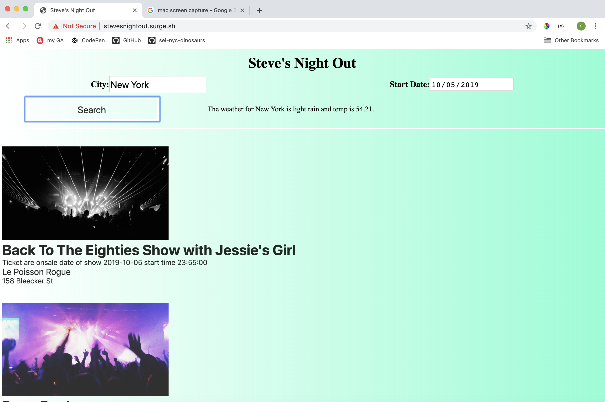
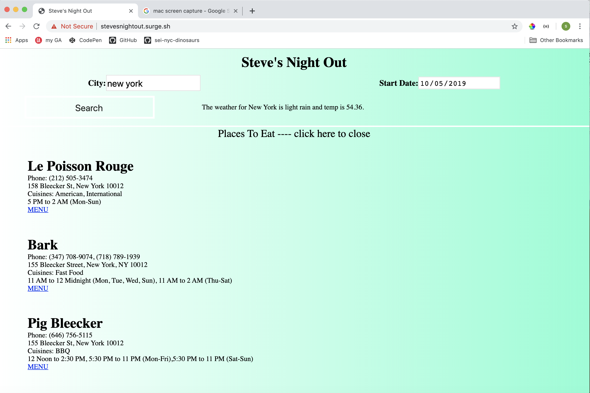

# Nightout

**PURPOSE:**

Purpose of this application will be finding show/concerts and places to eat near the choosen event venue.
 Given city will display current weather (openweathermap) and given dates ( user supplied - not spanning over two weeks to keep performance reasonable) will list events (ticket master) in date order, event name, date, start time, if tickets on sale, venu, and venu address;
if the event is clicked on a list of nearby places to eat will be presented.
places to eat (zomato) will contain Name, timmings, cusine, addresss, phone number , "highlights".

**WireFrames:**

**APIs**

*Ticket Master*
> let call = `https://app.ticketmaster.com/discovery/v2/events.json?classificationName=music&city=new+york&startDateTime=2019-10-01T00:00:00Z&endDateTime=2019-10-02T00:00:00Z&apikey=${apiKey}`
>  let response = await axios.get(call)
>   console.log(response) 
>  
>  
>  
>  
>  {data: {…}, status: 200, statusText: "OK", headers: {…}, config: {…}, …}
> config: {url: "https://app.ticketmaster.com/discovery/v2/events.j…00:00:00Z&apikey=akion17PwVgaKiA8J7Cock26wsaxM9oa", method: "get", headers: {…}, transformRequest: Array(1), transformResponse: Array(1), …}
> data:
> page: {size: 20, totalElements: 22, totalPages: 2, number: 0}
> _embedded:
> events: Array(20)
> 0:
> classifications: [{…}]
> dates:
> spanMultipleDays: false
> start:
> dateTBA: false
> dateTBD: false
> dateTime: "2019-10-01T00:00:00Z"
> localDate: "2019-09-30"
> localTime: "20:00:00"
> noSpecificTime: false
> timeTBA: false
> __proto__: Object
> status:
> code: "onsale"
> __proto__: Object
> __proto__: Object
> id: "Z7r9jZ1Aeqo4w"
> images: Array(10)
> 0:
> fallback: true
> height: 576
> ratio: "16_9"
> url: "https://s1.ticketm.net/dam/c/aae/b503db1a-c908-473b-a218-96d123cd5aae_105501_TABLET_LANDSCAPE_16_9.jpg"
> width: 1024
> __proto__: Object
> 1: {ratio: "16_9", url: "https://s1.ticketm.net/dam/c/aae/b503db1a-c908-473…218-96d123cd5aae_105501_RETINA_LANDSCAPE_16_9.jpg", width: 1136, height: 639, fallback: true}
> 2: {ratio: "4_3", url: "https://s1.ticketm.net/dam/c/aae/b503db1a-c908-473b-a218-96d123cd5aae_105501_CUSTOM.jpg", width: 305, height: 225, fallback: true}
> 3: {ratio: "16_9", url: "https://s1.ticketm.net/dam/c/aae/b503db1a-c908-473…18-96d123cd5aae_105501_EVENT_DETAIL_PAGE_16_9.jpg", width: 205, height: 115, fallback: true}
> 4: {ratio: "16_9", url: "https://s1.ticketm.net/dam/c/aae/b503db1a-c908-473…a218-96d123cd5aae_105501_RETINA_PORTRAIT_16_9.jpg", width: 640, height: 360, fallback: true}
> 5: {ratio: "16_9", url: "https://s1.ticketm.net/dam/c/aae/b503db1a-c908-473…d123cd5aae_105501_TABLET_LANDSCAPE_LARGE_16_9.jpg", width: 2048, height: 1152, fallback: true}
> 6: {ratio: "3_2", url: "https://s1.ticketm.net/dam/c/aae/b503db1a-c908-473b-a218-96d123cd5aae_105501_ARTIST_PAGE_3_2.jpg", width: 305, height: 203, fallback: true}
> 7: {ratio: "16_9", url: "https://s1.ticketm.net/dam/c/aae/b503db1a-c908-473b-a218-96d123cd5aae_105501_RECOMENDATION_16_9.jpg", width: 100, height: 56, fallback: true}
> 8: {ratio: "3_2", url: "https://s1.ticketm.net/dam/c/aae/b503db1a-c908-473b-a218-96d123cd5aae_105501_RETINA_PORTRAIT_3_2.jpg", width: 640, height: 427, fallback: true}
> 9: {ratio: "3_2", url: "https://s1.ticketm.net/dam/c/aae/b503db1a-c908-473…a218-96d123cd5aae_105501_TABLET_LANDSCAPE_3_2.jpg", width: 1024, height: 683, fallback: true}
> length: 10
> __proto__: Array(0)
> locale: "en-us"
> name: "Little Shop of Horrors"
> sales:
> public:
> endDateTime: "2019-10-01T00:00:00Z"
> startDateTime: "1900-01-01T06:00:00Z"
> startTBD: false
> __proto__: Object
> __proto__: Object
> seatmap: {staticUrl: "http://resale.ticketmaster.com.au/akamai-content/maps/2225-1-1-main.gif"}
> test: false
> type: "event"
> url: "http://www.ticketsnow.com/InventoryBrowse/TicketList.aspx?PID=2751572"
> _embedded:
> attractions: [{…}]
> venues: Array(1)
> 0:
> address: {line1: "252 W 81st St"}
> city: {name: "New York"}
> country: {name: "United States Of America", countryCode: "US"}
> dmas: [{…}]
> id: "ZFr9jZdddk"
> locale: "en-us"
> location:
> latitude: "40.785999"
> longitude: "-73.9758"
> __proto__: Object
> name: "Westside Theatre Upstairs - NY"
> postalCode: "10024"
> state: {name: "New York", stateCode: "NY"}
> test: false
> timezone: "America/New_York"
> type: "venue"
> upcomingEvents: {_total: 91, tmr: 91}
> _links: {self: {…}}
> __proto__: Object
> length: 1
> __proto__: Array(0)
> __proto__: Object
> _links: {self: {…}, attractions: Array(1), venues: Array(1)}
> __proto__: Object
> 1: {name: "Little Shop of Horrors", type: "event", id: "Z7r9jZ1Aeqo4M", test: false, url: "http://www.ticketsnow.com/InventoryBrowse/TicketList.aspx?PID=2751577", …}
> 2: {name: "Maggie Rogers: Heard It In A Past Life World Tour", type: "event", id: "G5dYZ4JSxfool", test: false, url: "https://www.ticketmaster.com/maggie-rogers-heard-i…w-york-new-york-10-01-2019/event/3C00566CE251146B", …}
> 3: {name: "Avril Lavigne "Head Above Water" Tour", type: "event", id: "G5vVZ4c3YgdXR", test: false, url: "https://www.ticketmaster.com/avril-lavigne-head-ab…w-york-new-york-10-01-2019/event/1D0056D4B0D43FAF", …}
> 4: {name: "Tedeschi Trucks Band", type: "event", id: "G5diZ4I3mCsT1", test: false, url: "https://www.ticketmaster.com/tedeschi-trucks-band-…w-york-new-york-10-01-2019/event/3B005684AE3B1FCA", …}
> 5: {name: "Built To Spill - Keep It Like A Secret", type: "event", id: "k7vGF4P2Fvd5a", test: false, url: "https://www.ticketmaster.com/built-to-spill-keep-i…w-york-new-york-10-01-2019/event/00005653C80432C9", …}
> 6: {name: "Songwriters Under the Covers with Victoria Shaw: Guests Patty Smyth, Lee Brice and a surprise guest", type: "event", id: "rZ7HnEZ1Aax3a4", test: false, url: "https://www.ticketweb.com/event/songwriters-under-the-covers-with-iridium-tickets/9892255", …}
> 7: {name: "Ciara", type: "event", id: "k7vGF4lz6y_Ux", test: false, url: "https://www.ticketmaster.com/ciara-new-york-new-york-10-01-2019/event/000056BE07E59DA2", …}
> 8: {name: "Witt Lowry w/ Xuitcasecity", type: "event", id: "Z7r9jZ1AejUOk", test: false, url: "http://www.ticketsnow.com/InventoryBrowse/TicketList.aspx?PID=2736806", …}
> 9: {name: "Freestyle Love Supreme", type: "event", id: "Z7r9jZ1AejYOO", test: false, url: "http://www.ticketsnow.com/InventoryBrowse/TicketList.aspx?PID=2730820", …}
> 10: {name: "Freestyle Love Supreme", type: "event", id: "Z7r9jZ1AejYO_", test: false, url: "http://www.ticketsnow.com/InventoryBrowse/TicketList.aspx?PID=2730819", …}
> 11: {name: "The Town Hall Presents  Debbie Harry: Face It", type: "event", id: "vv1AYv9eKGAG_YU6", test: false, url: "https://www.ticketmaster.com/the-town-hall-present…w-york-new-york-09-30-2019/event/030057093C670D87", …}
> 12: {name: "Being As an Ocean", type: "event", id: "k7vGF4R7Z_twl", test: false, url: "http://concerts.livenation.com/event/000056F100669CAB", …}
> 13: {name: "Up and Orange, Laura Danae", type: "event", id: "k7vGF4s3lUdb_", test: false, url: "https://www.eventbrite.com/e/up-and-orange-laura-danae-tickets-67316366063", …}
> 14: {name: "HOT 97 WHO'S NEXT Presents: The SoSo Def Women's C…  DJ Juanyto & DJ Drewski Hosted By Shani Kulture", type: "event", id: "rZ7HnEZ1Aax4bA", test: false, url: "https://www.ticketweb.com/event/hot-97-whos-next-the-sobs-tickets/9895605", …}
> 15: {name: "Acid King", type: "event", id: "Z7r9jZ1AeQpJe", test: false, url: "http://www.ticketsnow.com/InventoryBrowse/TicketList.aspx?PID=2696982", …}
> 16: {name: "Mingus Big Band", type: "event", id: "rZ7HnEZ1Aa_9a4", test: false, url: "https://www.ticketweb.com/event/mingus-big-band-jazz-standard-tickets/9657255", …}
> 17: {name: "Mingus Big Band", type: "event", id: "rZ7HnEZ1Aa_9aA", test: false, url: "https://www.ticketweb.com/event/mingus-big-band-jazz-standard-tickets/9657245", …}
> 18: {name: "Marty Schwartz", type: "event", id: "rZ7HnEZ1AajgvP", test: false, url: "https://www.ticketweb.com/event/marty-schwartz-iridium-tickets/9735065", …}
> 19: {name: "New Talent", type: "event", id: "rZ7HnEZ1Aap3oP", test: false, url: "https://www.ticketweb.com/event/new-talent-carolines-on-broadway-tickets/9592465", …}
> length: 20
> __proto__: Array(0)
> __proto__: Object
> _links: {first: {…}, self: {…}, next: {…}, last: {…}}
> __proto__: Object
> headers: {content-type: "application/json;charset=utf-8"}
> request: XMLHttpRequest {readyState: 4, timeout: 0, withCredentials: false, upload: XMLHttpRequestUpload, onreadystatechange: ƒ, …}
> status: 200
> statusText: "OK"
> __proto__:
> constructor: ƒ Object()
> hasOwnProperty: ƒ hasOwnProperty()
> isPrototypeOf: ƒ isPrototypeOf()
> propertyIsEnumerable: ƒ propertyIsEnumerable()
> toLocaleString: ƒ toLocaleString()
> toString: ƒ toString()
> valueOf: ƒ valueOf()
> __defineGetter__: ƒ __defineGetter__()
> __defineSetter__: ƒ __defineSetter__()
> __lookupGetter__: ƒ __lookupGetter__()
> __lookupSetter__: ƒ __lookupSetter__()
> get __proto__: ƒ __proto__()
> set __proto__: ƒ __proto__()

*Zomato*

> 
> let latitude = "40.785999"
>   let longitude = "-73.9758"
>   const apiKey2 =   // need to put this on header
>   // --header "user-key: 
>   let call2 = `https://developers.zomato.com/api/v2.1/search?entity_type=zone&lat=40.785999&lon=-73.9758&radius=10000&sort=real_distance&order=asc`
>   let response2 = await axios.get(call2, {
>     headers: { "user-key": apiKey2 }
>   }
>   
>   
>   
>   {data: {…}, status: 200, statusText: "", headers: {…}, config: {…}, …}config: {url: "https://developers.zomato.com/api/v2.1/search?enti…73.9758&radius=10000&sort=real_distance&order=asc", method: "get", headers: {…}, transformRequest: Array(1), transformResponse: Array(1), …}data: restaurants: Array(20)0: restaurant: R: {has_menu_status: {…}, res_id: 16790933}all_reviews: {reviews: Array(4)}reviews: Array(4)0: review: {rating: 4, review_text: "I love this restaurant.  Lamb retrata and whole ro…sphere compensates.  Great patio fir warm weather", id: 31535706, rating_color: "5BA829", review_time_friendly: "Aug 28, 2017", …}__proto__: Object1: {review: {…}}2: {review: {…}}3: {review: {…}}length: 4__proto__: Array(0)__proto__: Objectall_reviews_count: 4apikey: "3c598f982993090807e390277ff00634"average_cost_for_two: 120book_again_url: ""book_form_web_view_url: ""cuisines: "Mediterranean, Middle Eastern, Moroccan"currency: "$"deeplink: "zomato://restaurant/16790933"establishment: Array(1)0: "Casual Dining"length: 1__proto__: Array(0)establishment_types: Array(0)length: 0__proto__: Array(0)events_url: "https://www.zomato.com/new-york-city/bustan-upper-west-side/events#tabtop?utm_source=api_basic_user&utm_medium=api&utm_campaign=v2.1"featured_image: "https://b.zmtcdn.com/data/res_imagery/16790933_RESTAURANT_3793d72254f487b84776db71f24bc84e.jpg"has_online_delivery: 0has_table_booking: 0highlights: Array(11)0: "Credit Card"1: "Takeaway Available"2: "Dinner"3: "Delivery"4: "Lunch"5: "Serves Alcohol"6: "Wifi"7: "Fullbar"8: "Table booking recommended"9: "Outdoor Seating"10: "Kosher"length: 11__proto__: Array(0)id: "16790933"include_bogo_offers: trueis_book_form_web_view: 0is_delivering_now: 0is_table_reservation_supported: 0is_zomato_book_res: 0location: address: "487 Amsterdam Avenue 10024"city: "New York City"city_id: 280country_id: 216latitude: "40.7858900000"locality: "Upper West Side"locality_verbose: "Upper West Side"longitude: "-73.9759100000"zipcode: "10024"__proto__: Objectmenu_url: "https://www.zomato.com/new-york-city/bustan-upper-west-side/menu?utm_source=api_basic_user&utm_medium=api&utm_campaign=v2.1&openSwipeBox=menu&showMinimal=1#tabtop"mezzo_provider: "OTHER"name: "Bustan"offers: Array(0)length: 0__proto__: Array(0)opentable_support: 0phone_numbers: "(212) 595-5050, (212) 595-5050"photo_count: 172photos: (10) [{…}, {…}, {…}, {…}, {…}, {…}, {…}, {…}, {…}, {…}]photos_url: "https://www.zomato.com/new-york-city/bustan-upper-west-side/photos?utm_source=api_basic_user&utm_medium=api&utm_campaign=v2.1#tabtop"price_range: 4switch_to_order_menu: 0thumb: "https://b.zmtcdn.com/data/res_imagery/16790933_RESTAURANT_3793d72254f487b84776db71f24bc84e.jpg?fit=around%7C200%3A200&crop=200%3A200%3B%2A%2C%2A"timings: "11 AM to 3 PM, 5 PM to 11 PM (Mon-Fri),10 AM to 3 PM, 5 PM to 11 PM (Sat),10 AM to 3 PM, 5 PM to 10 PM (Sun)"url: "https://www.zomato.com/new-york-city/bustan-upper-west-side?utm_source=api_basic_user&utm_medium=api&utm_campaign=v2.1"user_rating: aggregate_rating: "3.5"rating_color: "9ACD32"rating_obj: bg_color: {type: "lime", tint: "300"}title: {text: "3.5"}__proto__: Objectrating_text: "Good"votes: "10"__proto__: Object__proto__: Object__proto__: Object1: {restaurant: {…}}2: {restaurant: {…}}3: {restaurant: {…}}4: {restaurant: {…}}5: {restaurant: {…}}6: {restaurant: {…}}7: {restaurant: {…}}8: {restaurant: {…}}9: {restaurant: {…}}10: {restaurant: {…}}11: {restaurant: {…}}12: {restaurant: {…}}13: {restaurant: {…}}14: {restaurant: {…}}15: {restaurant: {…}}16: {restaurant: {…}}17: {restaurant: {…}}18: {restaurant: {…}}19: {restaurant: {…}}length: 20__proto__: Array(0)results_found: 42750results_shown: 20results_start: 0__proto__: Objectheaders: {content-length: "21883", content-type: "application/json", cache-control: "max-age=0, no-cache, no-store, no-transform"}request: XMLHttpRequest {readyState: 4, timeout: 0, withCredentials: false, upload: XMLHttpRequestUpload, onreadystatechange: ƒ, …}status: 200statusText: ""__proto__: Object  
> 
>   
  
  
  *open weather*
  
>   
>   let call = `http://api.openweathermap.org/data/2.5/weather?${city}&units=imperial&APPID=${apiKey}`
>   let response = await axios.get(call, { "x-api-key": apiKey })
>   weatherMessageArea.innerHTML = `<h3>The weather for ${response.data.name} is ${response.data.weather[0].description}</h3><h3 id="temp">temp is  ${response.data.main.temp} </h3><h3>MIN temp is  ${response.data.main.temp_min} </h3><h3>MAX temp is  ${response.data.main.temp_max} </h3>`
>   
>   
>   
>   / http://api.openweathermap.org/data/2.5/weather?q=new+york&units=imperial&APPID=27e463638bbb0944607b2515c9421322
> 
> {
>   "coord": {
>     "lon": -73.99,
>     "lat": 40.73
>   },
>   "weather": [
>     {
>       "id": 802,
>       "main": "Clouds",
>       "description": "scattered clouds",
>       "icon": "03d"
>     }
>   ],
>   "base": "stations",
>   "main": {
>     "temp": 77.81,
>     "pressure": 1023,
>     "humidity": 34,
>     "temp_min": 73.99,
>     "temp_max": 81
>   },
>   "visibility": 16093,
>   "wind": {
>     "speed": 9.17,
>     "deg": 350
>   },
>   "clouds": {
>     "all": 40
>   },
>   "dt": 1569788167,
>   "sys": {
>     "type": 1,
>     "id": 4698,
>     "message": 0.0113,
>     "country": "US",
>     "sunrise": 1569754206,
>     "sunset": 1569796949
>   },
>   "timezone": -14400,
>   "id": 5128581,
>   "name": "New York",
>   "cod": 200
> }

**Features**

Given city will display current weather (openweathermap) and given dates ( user supplied - not spanning over two weeks to keep performance reasonable) will list events (ticket master) in date order, event name, date, start time, if tickets on sale, venu, and venu address;
if the event is clicked on a list of nearby places to eat will be presented.
places to eat (zomato) will contain Name, timmings, cusine, addresss, phone number , "highlights".

**Stretch Goals**

could add more images, could add link for event at other venus or dates 
add link for menu and/or rerviews
include additional search paths

**Approach**

on search button click
 clear event buttons & modal
 hide modal
 minor edit ingnput
 weather api
 ticketmaster api
 build 'event' buttons for ticket master data
 on click of 'event' button 
  pass geo-location info in the venue section of 
  the ticket master api data to zomato api and          
  find resturants close to venu and list in 
  scrollable modal and show.

**Struggles**

getting the modal to scroll and not truncate
google  and 'test and learn'

**Problems not solved**
wanted to do 'onload' to pre-populate the screen which could have been used in conjunction with feed in by geo-locate by ip - ran out of time

**code proud of **
getting the whole thing to work

**USE**

Allows a user to pick a city and date and get a list of concerts scheduled for that date, aloing with the venue and by clicking on the event the user can get a list of places to eat near the venu.

**URL:**

http://stevesnightout.surge.sh

**NAV:**

fill in the city and date and click the search button
the user will see a scrollable list of events

click on any of the events and the user will get a list of places to eat closest to the venus for the show

 
